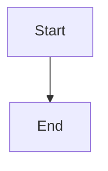

# 验收样本

普通脚注引用[^first]，重复引用[^first]，未定义引用[^missing]。

行内公式：$a^2 + b^2 = c^2$

块级公式：

$$
\int_0^1 x^2 dx = \frac{1}{3}
$$

```mermaid
graph TD
  A[Start] --> B[End]
```

坏 Mermaid：

```mermaid
graph TD
  A -->
```

[^first]: 这是脚注内容。

结尾行
